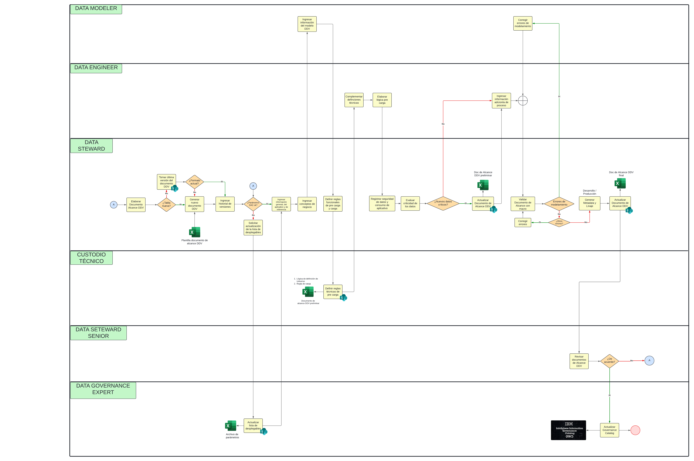

# Migración de Analítica de Datos

## Principal servicio ofrecido

La migración de datos, esto se refiere a la transferencia de datos entre diferentes tipos de formatos de archivos, esquemas de bases de datos y sistemas de almacenamiento. Incluye asignaciones y transformaciones entre datos de origen y de destino si los datos son diversos.

Primero, se recibe la información *desordenada*.

Luego pasa por **calidad de datos**, debe evaluarse antes de la migración para garantizar una implementación exitosa sin pérdida de datos. La tasa de éxito de cualquier proyecto de migración de datos depende de la diversidad, el volumen y la calidad de los datos que se transfieren.

Por último, se entrega la información estructurada. Por información nos refirimoos a tablas, aplicaciones, scores (conjunto de datos relacionados con un fin: perfil cliente, tipo de préstamo (hipotecario, vehicular, personal), etc).

## Descripción del proceso

Procesos para migrar datos en base a los roles:

* [LinkFlujograma:] (https://lucid.app/lucidchart/29fab1dd-40e5-4da9-84bc-d9a41e26717b/edit?viewport_loc=-5830%2C-829%2C8710%2C3790%2C0_0&invitationId=inv_ad1e5fc2-becf-482e-b4bc-954471623807)

**1. Data architec:** Estructura el flujo de información de inicio a fin.

**2. Data governance:** Solicita, recibe y transforma la información del usuario origen. Relevamiento de información. 

**3. Data modeler:** Modelar los objetos (esquemas, tablas, base de datos, etc).

**4. Data engieneer:** Recibe la info del data governance y en base al modelamiento de datos crea las tablas con sus respectivos esquemas dentro de DB.

**5.Data quality:** Responsable de verificar que lo que hizo el data engieneer en base a lo proporcionado por el data governance es correcto.

[Selección de la empresa](seleccion_empresa.md)

[Regresar al índice](../README.md)