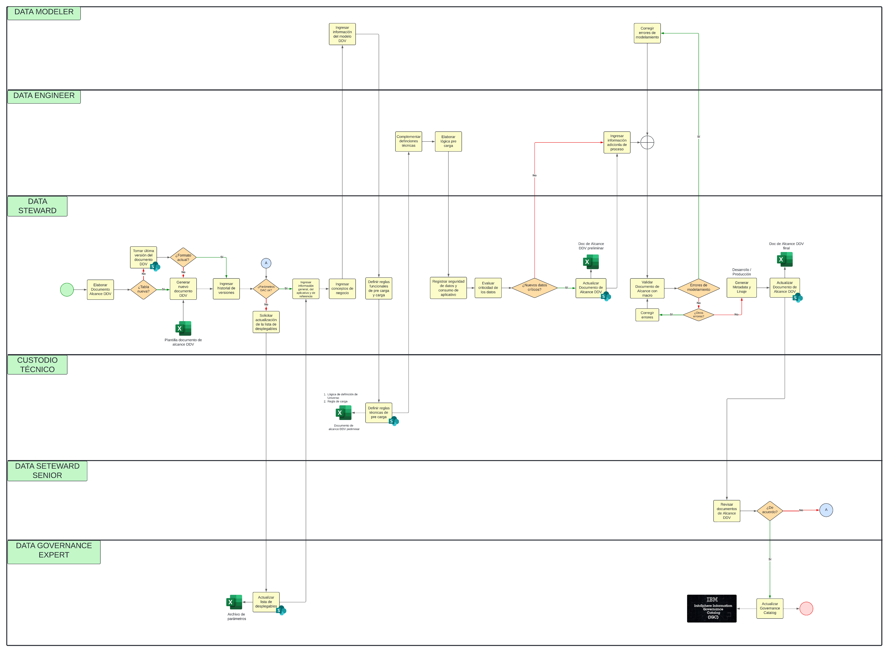

# Migración de Analítica de Datos

## Principal servicio ofrecido

La migración de datos, esto se refiere a la transferencia de datos entre diferentes tipos de formatos de archivos, esquemas de bases de datos y sistemas de almacenamiento. Incluye asignaciones y transformaciones entre datos de origen y de destino si los datos son diversos.

Primero, se recibe la información _desordenada_.

Luego pasa por **calidad de datos**, debe evaluarse antes de la migración para garantizar una implementación exitosa sin pérdida de datos. La tasa de éxito de cualquier proyecto de migración de datos depende de la diversidad, el volumen y la calidad de los datos que se transfieren.

Por último, se entrega la información estructurada. Por información nos refirimoos a tablas, aplicaciones, scores (conjunto de datos relacionados con un fin: perfil cliente, tipo de préstamo (hipotecario, vehicular, personal), etc).

## Responsables del proceso

**1. Data architec:** Estructura el flujo de información de inicio a fin.

**2. Data governance:** Solicita, recibe y transforma la información del usuario origen. Relevamiento de información.

**3. Data modeler:** Modelar los objetos (esquemas, tablas, base de datos, etc).

**4. Data engieneer:** Recibe la info del data governance y en base al modelamiento de datos crea las tablas con sus respectivos esquemas dentro de DB.

**5.Data quality:** Responsable de verificar que lo que hizo el data engieneer en base a lo proporcionado por el data governance es correcto.

## Descripción del proceso

Procesos para migrar datos en base a los roles:

- [Ver el Flujograma Completo en LucidChart](https://lucid.app/lucidchart/29fab1dd-40e5-4da9-84bc-d9a41e26717b/edit?viewport_loc=-9379%2C-1461%2C8710%2C3790%2C0_0&invitationId=inv_ad1e5fc2-becf-482e-b4bc-954471623807)

| Secuencia | Actividad                                          | Descripción         | Responsable  |
| --------- | -------------------------------------------------- | ------------------- | ------------ |
| 1         | Elaborar la plantilla del Documento de Alcance DDV | Inserte Descripción | Data Steward |
| 2         | Tomar última versión del documento DDV | Inserte Descripción | Data Steward |
| 3         | Generar nuevo documento DDV | Inserte Descripción | Data Steward |
| 4         | Ingresar historial de versiones | Inserte Descripción | Data Steward |
| 5         | Solicitar actualización de la lista de desplegables | Inserte Descripción | Data Steward |
| 6         | Actualizar lista de desplegables | Inserte Descripción | Data Gobernance Expert |
| 7         | Ingresar información general, del aplicativo y de referencia | Inserte Descripción | Data Steward |
| 8         | Ingresar conceptos de negocio | Inserte Descripción | Data Steward |
| 9         | Ingresar información del modelo DDV | Inserte Descripción | Data Modeler |
| 10        | Definir reglas funcionales de pre carga y carga | Inserte Descripción | Data Stewart |
| 11        | Definir reglas técnicas de pre carga | Inserte Descripción | Custodio Técnico |
| 12        | Complementar definciones técnicas | Inserte Descripción | Data Engineer |
| 13        | Elaborar lógica pre carga | Inserte Descripción | Data Engineer |
| 14        | Registrar seguridad de datos y consumo de aplicativo | Inserte Descripción | Data Stewart |
| 15        | Evaluar criticidad de los datos | Inserte Descripción | Data Stewart |
| 16        | Ingresar información adicional de proceso | Inserte Descripción | Data Engineer |
| 17        | Actualizar Documento de Alcance DDV | Inserte Descripción | Data Stewart |
| 18        | Validar Documento de Alcance con macro | Inserte Descripción | Data Stewart |
| 19        | Corregir errores | Inserte Descripción | Data Stewart |
| 20        | Corregir errores de modelamiento | Inserte Descripción | Data Modeler |
| 21        | Generar Metadata y Linaje | Inserte Descripción | Data Stewart |
| 22        | Revisar documentos de Alcance DDV | Inserte Descripción | Data Stewart Senior |
| 23        | Actualizar Governance Catalog | Inserte Descripción | Data Stewart |
| 24        | Actualizar Documento de Alcance DDV | Inserte Descripción | Data Gobernance Expert |

[Regresar al índice](../README.md)
